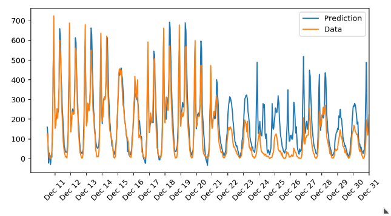

# Deep_Learning_Bike_Sharing

The first project of my [Deep Learning](https://www.udacity.com/course/deep-learning-nanodegree--nd101) Nanodegree from [Udacity](https://www.udacity.com/), see the [Completion Certificate](https://graduation.udacity.com/confirm/QCK3UKSS).

In this project I build my first neural network and use it to predict daily bike rental ridership.

**Prediction:**

**Conclusions:**
- The final version of the model with 4000 iterations, `learning_rate = 0.3` and `hidden_nodes = 20` describes the data better than the same model with 1000 iterations, see two last figures.
- The model is especially good for the dates before Dec 22.
- In the period from Dec 22 to Dec 31 the model overestimates the data by a factor of 2. It is better than underestimation for the same model with only 1000 iterations, because base on the prediction the Bike-Sharing shop would propose more bikes than demanded, but still have got all the possible clients.
- In order to answer about the reasons of the failures one should make more research: explore the correlations between the parameters of the model, add more layers and output nodes.

**Libraries and methods used:** `matplotlib.pyplot`, `NumPy`, `Pandas`, `sys`, `unittest`.
